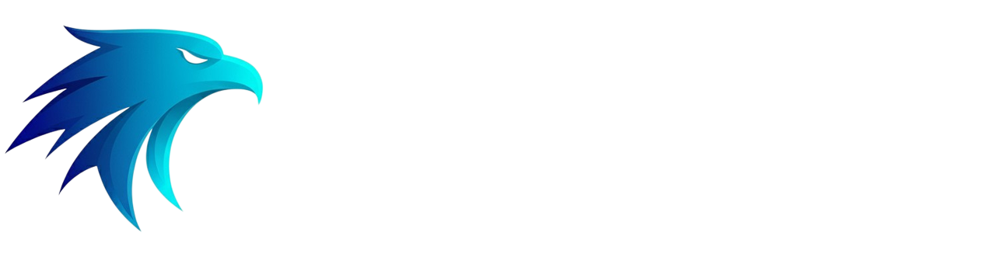

<div align="center">
  
</div>

# 🎮 Apex Games - Game Discovery Platform

Une plateforme moderne et complète pour découvrir, explorer et gérer votre collection de jeux vidéo. Intégrée avec l'API RAWG pour afficher les jeux tendances et proposer une expérience de découverte optimale.

## ✨ Fonctionnalités

### 🏠 Page d'accueil
- **Interface moderne** avec design sombre et animations fluides
- **Intégration RAWG API** pour récupérer les jeux tendances en temps réel
- **Design responsive** adapté à tous les écrans
- **Compteurs animés** avec métriques de la plateforme

### 🎯 Découverte de jeux
- **Catalogue complet** de jeux avec filtres avancés
- **Détails détaillés** pour chaque jeu
- **Système de favoris** pour sauvegarder vos jeux préférés
- **Pagination intelligente** pour une navigation fluide

### 📋 Gestion de backlog
- **Tableau Kanban** pour organiser vos jeux
- **Drag & Drop** pour réorganiser facilement
- **Colonnes personnalisables** (À jouer, En cours, Terminé, etc.)
- **Interface intuitive** pour gérer votre progression

### 👤 Authentification
- **Système de connexion/inscription** sécurisé
- **Gestion des sessions** utilisateur
- **Profil personnel** pour personnaliser l'expérience

## 🚀 Technologies utilisées

### Frontend
- **React 19** - Framework frontend moderne
- **TypeScript** - Typage statique pour plus de robustesse
- **Vite** - Build tool ultra-rapide
- **React Router** - Navigation côté client
- **Zustand** - Gestion d'état légère
- **Axios** - Client HTTP pour les appels API
- **Lucide React** - Icônes modernes
- **CSS3** - Styles personnalisés avec animations

### Backend
- **NestJS** - Framework Node.js robuste et scalable
- **TypeScript** - Typage statique côté serveur
- **Express** - Serveur web sous-jacent
- **Jest** - Framework de tests

### API externe
- **RAWG API** - API de données de jeux vidéo complète

## 📦 Installation et Configuration

### Prérequis
- Node.js (version 18 ou supérieure)
- npm ou yarn
- Clé API RAWG (gratuite)

### 1. Cloner le repository
```bash
git clone <url-du-repo>
cd apex-games
```

### 2. Configuration Backend
```bash
cd apex-games-backend
npm install
npm run start:dev
```

### 3. Configuration Frontend
```bash
cd apex-games-frontend
npm install
```

### 4. Variables d'environnement
Créer un fichier `.env` dans `apex-games-frontend/` :
```env
VITE_RAWG_API_KEY=votre_cle_api_rawg
```

> 💡 **Obtenir une clé API RAWG** : Rendez-vous sur [RAWG.io](https://rawg.io/apidocs) pour créer un compte gratuit et obtenir votre clé API.

### 5. Lancer l'application
```bash
npm run dev
```

L'application sera accessible sur `http://localhost:5173`

## 🛠️ Scripts disponibles

### Frontend
```bash
npm run dev          # Serveur de développement
npm run build        # Build de production
npm run preview      # Prévisualisation de la build
npm run lint         # Vérification ESLint
```

### Backend
```bash
npm run start:dev    # Serveur de développement avec watch
npm run start        # Serveur de production
npm run build        # Build de production
npm run test         # Tests unitaires
npm run test:e2e     # Tests end-to-end
npm run lint         # Vérification ESLint
```

## 📁 Structure du projet

```
apex-games/
├── apex-games-frontend/          # Application React
│   ├── src/
│   │   ├── api/                  # Services API
│   │   │   ├── Instances.ts      # Configuration Axios
│   │   │   └── Services.ts       # Fonctions API
│   │   ├── assets/               # Ressources statiques
│   │   │   ├── fonts/            # Polices personnalisées
│   │   │   └── images/           # Images et logos
│   │   ├── components/ui/        # Composants réutilisables
│   │   │   ├── AllGames.tsx      # Affichage de tous les jeux
│   │   │   ├── GameBacklogBoard.tsx # Tableau Kanban
│   │   │   ├── GameCard.tsx      # Carte de jeu
│   │   │   ├── Header.tsx        # En-tête
│   │   │   ├── TrendingGames.tsx # Jeux tendances
│   │   │   └── ...               # Autres composants
│   │   ├── pages/                # Pages de l'application
│   │   │   ├── Home.tsx          # Page d'accueil
│   │   │   ├── Games.tsx         # Catalogue des jeux
│   │   │   ├── GameDetails.tsx   # Détails d'un jeu
│   │   │   ├── GameBacklog.tsx   # Gestion du backlog
│   │   │   ├── Login.tsx         # Connexion
│   │   │   └── Register.tsx      # Inscription
│   │   ├── store/                # Gestion d'état
│   │   │   └── bookmarkStore.ts  # Store des favoris
│   │   ├── styles/               # Fichiers CSS
│   │   │   ├── components/       # Styles des composants
│   │   │   └── pages/            # Styles des pages
│   │   ├── types/                # Définitions TypeScript
│   │   └── utils/                # Utilitaires
│   └── package.json
├── apex-games-backend/           # API NestJS
│   ├── src/
│   │   ├── app.controller.ts     # Contrôleur principal
│   │   ├── app.service.ts        # Service principal
│   │   ├── app.module.ts         # Module principal
│   │   └── main.ts               # Point d'entrée
│   └── package.json
└── README.md
```

## 🎨 Composants principaux

### BannerWelcome
- Section d'accueil avec titre et métriques
- Compteurs animés (Played, Games, Ratings, Reviews, Lists)
- Bouton d'action principal

### TrendingGames
- Affichage des jeux tendances via l'API RAWG
- Grid responsive (6 colonnes sur desktop, adaptatif sur mobile)
- Gestion des états de chargement et d'erreur

### GameBacklogBoard
- Tableau Kanban pour organiser les jeux
- Colonnes drag & drop personnalisables
- Interface intuitive de gestion

### AllGames
- Catalogue complet avec filtres
- Pagination intelligente
- Système de recherche

## 🔧 Configuration avancée

### Variables d'environnement
- `VITE_RAWG_API_KEY` : Clé API RAWG (obligatoire)

### Proxy API
Le projet utilise un proxy Vite pour contourner les restrictions CORS :
```typescript
server: {
  proxy: {
    '/api': {
      target: 'https://api.rawg.io',
      changeOrigin: true,
      secure: false,
      rewrite: (path) => path.replace(/^\/api/, '/api')
    }
  }
}
```

## 🎯 Fonctionnalités détaillées

### Design responsive
- **Desktop** : 6 cartes par ligne
- **Tablet** : 3-4 cartes par ligne
- **Mobile** : 2 cartes par ligne

### Animations
- Effets de hover sur les cartes
- Transitions fluides
- Spinner de chargement personnalisé
- Compteurs animés

### Gestion d'erreurs
- Affichage d'erreurs API avec messages explicites
- Fallback en cas de clé API manquante
- États de chargement avec spinner centré

## 🚀 Déploiement

### Build de production Frontend
```bash
cd apex-games-frontend
npm run build
```

### Build de production Backend
```bash
cd apex-games-backend
npm run build
```

### Prévisualisation
```bash
npm run preview
```

## 🤝 Contribution

1. Fork le projet
2. Créer une branche feature (`git checkout -b feature/nouvelle-fonctionnalite`)
3. Commit les changements (`git commit -m 'Ajouter nouvelle fonctionnalité'`)
4. Push vers la branche (`git push origin feature/nouvelle-fonctionnalite`)
5. Ouvrir une Pull Request

## 🔗 Liens utiles

- [Documentation RAWG API](https://rawg.io/apidocs)
- [Documentation React](https://react.dev/)
- [Documentation NestJS](https://nestjs.com/)
- [Documentation Vite](https://vitejs.dev/)
- [Documentation TypeScript](https://www.typescriptlang.org/)

---

**Développé avec ❤️ en React + TypeScript + NestJS**
